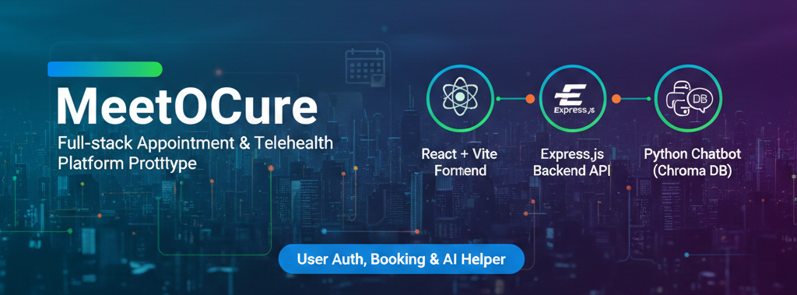

 # MeetOCure

 <!-- Badges: status, stack, license, live -->
 [](https://github.com/OneTeraByte7/MeetOCure/releases)
 [](https://nodejs.org/)
 [](https://vitejs.dev/)
 [](https://www.python.org/)
 [](LICENSE)
 [](https://meetocure.onrender.com)

MeetOCure is a full-stack prototype for appointment booking and telehealth workflows that combines a modern React frontend, a Node/Express API backend, and a lightweight Python chatbot backed by a local Chroma snapshot.

 ## Purpose
 Provide a usable prototype for patient–doctor scheduling, availability management, and an AI-assisted chat helper to demonstrate an integrated telehealth experience.

 ## Architecture (high level)

 - Frontend: React + Vite application ([frontend-ankit]) serving the UI and calling the REST API.
 - Backend API: Express.js application ([server]) with route modularization (auth, appointments, availability, hospitals, doctor/patient endpoints) and Mongoose models.
 - Chatbot: Python script in [ChatBot] that uses a local Chroma sqlite snapshot ([chroma_db2]) for retrieval-augmented responses.

 Components communicate over REST: frontend -> backend API; backend optionally proxies to AI/chat services.

 ## Key features

 - Email/password authentication with JWTs and role-based guards (doctor / patient).
 - Doctor availability management, slot creation, and appointment booking.
 - Search across doctors and hospitals with basic filtering.
 - AI chatbot prototype for contextual help using the included Chroma snapshot.
 - Modular backend controllers and a componentized React UI.

 ## Pros & Innovations

 - Clear separation of concerns: frontend UI, backend API, and standalone chatbot component.
 - Environment-aware frontend API helper to allow local development and deployed hosting parity.
 - Lightweight, local RAG (retrieval-augmented generation) chatbot using Chroma sqlite snapshot for offline experimentation.
 - Role-based access control and JWT tokens for secure API flows.
 - Modular controllers and route structure that make it straightforward to extend (e.g., add new resources, integrate third‑party ML services).

 ## Repository layout

 - `frontend-ankit/` — React (Vite) web application and UI components.
 - `server/` — Express API, routes, controllers, models, middleware, and DB config.
 - `ChatBot/` — Python chatbot script and `requirement.txt`.
 - `chroma_db2/` — included sqlite snapshot used by the chatbot.

 Key files:

 - Frontend entry: [frontend-ankit/package.json](frontend-ankit/package.json)
 - Backend entry: [server/server.js](server/server.js)
 - DB config: [server/config/db.js](server/config/db.js)
 - Chatbot script: [ChatBot/chatbot.py](ChatBot/chatbot.py)

 ## Tech stack

 - Frontend: React, Vite, Tailwind CSS
 - Backend: Node.js, Express, Mongoose (MongoDB)
 - Chatbot: Python, Chroma (sqlite snapshot)

 ## Quickstart (development)

 1. Backend

 ```bash
 cd server
 npm install
 # start the server (or use your dev runner)
 node server.js
 ```

 2. Frontend

 ```bash
 cd frontend-ankit
 npm install
 npm run dev
 ```

 3. Chatbot (optional)

 ```bash
 cd ChatBot
 python -m venv .venv
 # Windows
 .venv\Scripts\activate
 # macOS / Linux
 source .venv/bin/activate
 pip install -r requirement.txt
 python chatbot.py
 ```

 ## Environment variables

 Create `server/.env` with at least:

 ```
 MONGO_URI=your_mongo_connection_string
 JWT_SECRET=your_jwt_secret
 PORT=5000
 ```

 Ensure `JWT_SECRET` is set in your deployed host (Render, Heroku, etc.) so tokens are signed and verified correctly.

 ## Deployment notes

 - Backend: set `MONGO_URI` and `JWT_SECRET` in the host environment; the `PORT` variable will typically be provided by the host.
 - Frontend: build with `npm run build` and serve as static assets (Vercel, Netlify, or any static host).
 - Chatbot: if you need a hosted chatbot, move the Chroma data to a hosted store or containerize the Python component.

 ## Troubleshooting tips

 - If login returns 400, check the backend logs for request validation messages and verify `JWT_SECRET` is present.
 - Use the frontend `src/utils/api.js` helper or `VITE_API_URL` to point the UI to the correct backend during dev vs production.

 ## Contributing

 1. Fork and create a feature branch.
 2. Implement changes and include tests when applicable.
 3. Open a PR with a clear description.

 ## Suggested next steps I can help with

 - Add an `.env.example` file in `server/`.
 - Add a `README` badge for live demo URL and CI status.
 - Provide a small `run-all` script or Makefile to launch backend + frontend concurrently for development.

 If you want any of those, tell me which and I will add them.
1. Open a terminal and go to the `server` folder:
